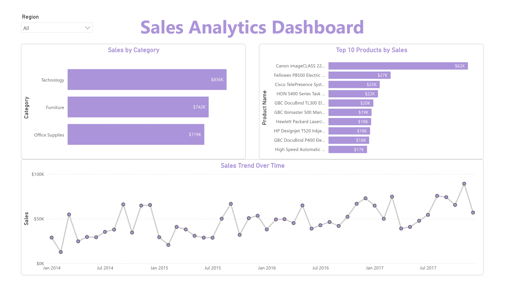

# # Sales Analytics Dashboard

This project analyses sales performance using Power BI to identify key trends and business insights.

## Tools Used
- Power BI  
- Excel  

## Key Features
- Sales breakdown by category  
- Monthly sales trend analysis  
- Top 10 products by revenue  
- Interactive filtering using slicers  

## Key Insights
- Technology category generated the highest revenue  
- Sales show consistent growth over time with seasonal fluctuations  
- A small number of products contribute significantly to total sales  

## Project Preview

